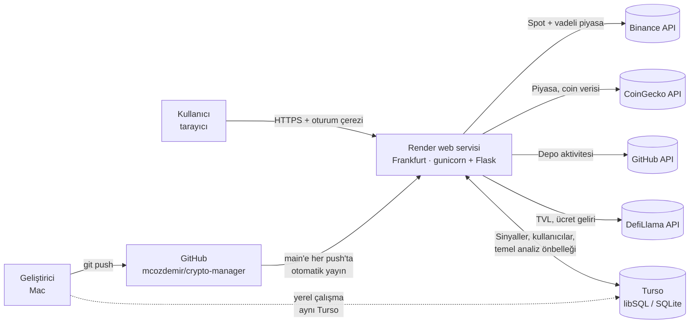
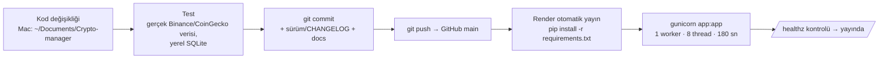

# Crypto Manager — Teknik Altyapı

> Ürünün teknik altyapısını, veri akışını (pipeline) ve yayın sürecini özetler. Altyapıyı
> etkileyen her değişiklikte aynı commit içinde güncellenir. Ürün kuralları için:
> [`KURALLAR.md`](KURALLAR.md).
>
> Son güncelleme: **v1.3.1** · 2026-09-30

## 1. Genel bakış



| Katman | Teknoloji |
|---|---|
| Dil / çatı | Python 3.12, Flask 3 (sunucu tarafında HTML şablonu + JSON API) |
| Arayüz | Tek sayfa `templates/index.html` (düz HTML/CSS/JS, harici kütüphane yok), `templates/login.html` |
| Analiz | pandas, numpy, scipy (pivot/regresyon), mplfinance + matplotlib (grafik PNG) |
| Veritabanı | Turso (libSQL, SQLite uyumlu) — HTTP API üzerinden, ek paket gerektirmez. `.env` yoksa yerel `signal_journal.db` |
| Yayın | Render (ücretsiz plan, Frankfurt), `render.yaml` Blueprint, gunicorn |
| Kaynak kod | GitHub `mcozdemir/crypto-manager`, `main` dalı |
| Kimlik doğrulama | Kullanıcı adı + TOTP (Authenticator), Flask imzalı oturum çerezi |

## 2. Dosya haritası

| Dosya | Görev |
|---|---|
| `app.py` | Flask uygulaması: sayfalar, JSON API, arka plan iş parçacıkları (tarama, backtest, coin arama) |
| `auth.py` | Giriş/çıkış, TOTP doğrulama, kaba kuvvet koruması, güvenlik başlıkları |
| `manage_users.py` | Komut satırından kullanıcı ekleme/listeleme/sıfırlama/kapatma/silme (QR kod) |
| `scanner.py` | Tarama boru hattı (pipeline) orkestrasyonu: tam tarama ve tek coin arama |
| `utils.py` | Binance spot REST istemcisi (sembol listesi, mum, fiyat) |
| `indicators.py` | RSI, MACD, EMA, ADX, ATR, OBV |
| `patterns.py` | Pivot tespiti ve 10 formasyon dedektörü, geçerlilik kontrolleri |
| `scoring.py` | Formasyon skoru (100 üzerinden) ve tahmini başarı olasılığı |
| `charts.py` | Formasyon grafiği (PNG, `charts/`) |
| `confidence.py` | Güven endeksleri: geçmiş başarı, piyasa yönü, Crypto Manager, risk/ödül; tarama bağlamı (`ScanContext`) |
| `fundamentals.py` | Temel analiz: CoinGecko / GitHub / DefiLlama verisi, 24 saat önbellek, puanlama |
| `market_direction.py` | BTC / TOTAL / TOTAL2 / BTC.D piyasa rejimi |
| `journal.py` | Sinyal günlüğü: kayıt, tekrar önleme, durum güncelleme, filtreli okuma, sürüm istatistikleri |
| `db.py` | Veritabanı katmanı: Turso HTTP istemcisi / yerel SQLite, `.env` okuyucu |
| `backtest.py` | Yürüyen pencereli geçmiş test |
| `excel_export.py` | Tarama ve günlük için .xlsx dışa aktarma |
| `version.py` | Uygulama sürümü ve değişiklik günlüğü |
| `ayarlar.py` | Kullanıcı ayarları (port, coin sayısı, zaman dilimleri, eşikler) |
| `migrate_to_turso.py` | Yerel SQLite geçmişini Turso'ya aktarma (tek seferlik, tekrar çalıştırılabilir) |
| `main.py` | Komut satırı taraması |
| `render.yaml` | Render Blueprint (servis tanımı) |
| `Kripto Tarayıcıyı Başlat.command` | macOS çift tıklamalı yerel başlatıcı |
| `docs/` | `KURALLAR.md` (ürün kuralları), `ALTYAPI.md` (bu belge) |

## 3. Tarama boru hattı (pipeline)

```mermaid
sequenceDiagram
    participant UI as Arayüz
    participant API as Flask /api/scan
    participant S as scanner.run_scan (arka plan thread)
    participant BN as Binance
    participant C as confidence + fundamentals
    participant J as journal
    participant DB as Turso

    UI->>API: POST /api/scan (coin sayısı)
    API->>S: thread başlat (tek tarama kilidi)
    UI->>API: GET /api/status (1,2 sn'de bir)
    S->>BN: exchangeInfo + 24s ticker → ilk N USDT paritesi
    loop her coin × 1H/4H/1D
        S->>BN: 500 mum
        S->>S: indikatörler → formasyonlar → geçerlilik → skor (≥ 60)
        S->>S: yön çakışması eleme → grafik PNG
    end
    S->>C: ScanContext (toplu veriler, bir kez)
    C->>BN: 24s ticker, bookTicker, vadeli fonlama (toplu)
    C->>DB: geçmiş başarı istatistikleri
    C->>BN: BTC 1D; coin başına açık pozisyon + long/short (yalnız sinyal çıkanlar)
    C->>DB: temel analiz önbelleği (24 saat)
    C->>C: CoinGecko / GitHub / DefiLlama (eksik veya bayat olanlar, bütçeli)
    C->>S: her sinyale güven endeksleri + risk/ödül
    S->>J: record_signals (sürüm etiketiyle)
    J->>DB: tek işlemde toplu INSERT (6 saat tekrar önleme)
    S-->>API: sonuçlar bellekte (state)
    UI->>API: GET /api/results → tablo
```

**Performans notları**

- Tarama başına sabit istek sayısı: sembol listesi 2, coin başına 3 mum isteği.
- Güven endeksi için toplu uç noktalar (ticker, bookTicker, premiumIndex) tarama başına **bir
  kez** çağrılır; coin başına istekler yalnızca sinyal çıkan coinler için yapılır.
- Temel analiz ayrıntısı tarama başına en çok 12 (anahtarsız) / 40 (Demo anahtarla) coin.
- Ölçüm (Mac, 25 coin, gerçek veri): ~70 sn. Render ücretsiz planda (0,1 CPU) daha yavaştır.

## 4. Veri depolama

### 4.1 Turso tabloları

**`signals`** — sinyal günlüğü

| Sütun | Açıklama |
|---|---|
| `id`, `created_at` | Otomatik anahtar, kayıt zamanı (yerel saat, ISO) |
| `symbol`, `timeframe`, `pattern`, `direction` | Sinyal kimliği |
| `entry_price`, `target`, `stop_loss` | Giriş, hedef, stop |
| `score`, `success_probability`, `label` | Formasyon skoru, tahmini başarı, etiket |
| `status`, `closed_at`, `close_price` | AÇIK / HEDEF / STOP ve kapanış bilgisi |
| `last_checked_at`, `last_price` | Son fiyat kontrolü |
| `source` | Kaydeden makine adı |
| `market_score`, `fundamental_score`, `cm_score` | Güven endeksi puanları (0-100, sinyal yönüne göre) |
| `hist_rate`, `hist_n` | Kayıt anındaki geçmiş başarı oranı ve örnek sayısı |
| `rr` | Risk/ödül |
| `confidence_json` | Tüm endekslerin alt kırılımı (JSON) |
| `app_version`, `app_commit` | Uygulama sürümü ve commit (boş commit = geriye dönük etiket) |

İndeksler: `(symbol, timeframe, pattern, direction, status)`, `created_at`, `app_version`,
**benzersiz** `(symbol, timeframe, pattern, direction, created_at)`.

**`users`** — `username` (benzersiz, küçük harf), `totp_secret`, `is_active`,
`last_totp_step` (kod tekrarını önler), `created_at`, `last_login_at`.

**`coin_fundamentals`** — `base` (ör. ETH), `cg_id`, `data_json`, `complete`,
`updated_at` (24 saat geçerli).

Şema değişiklikleri uygulama açılışında otomatik göç (migration) ile yapılır
(`journal.init_db`, `ALTER TABLE ... ADD COLUMN`); elle işlem gerekmez.

### 4.2 Bellek ve disk (geçici)

| Veri | Yer | Ömür |
|---|---|---|
| Son tarama sonuçları, backtest, coin arama | Uygulama belleği (`state`) | Süreç yeniden başlayınca silinir |
| Grafik PNG'leri | `charts/` | Render'da her yeniden başlatmada silinir |
| Piyasa rejimi | Bellek | 60 sn |
| DefiLlama tabloları | Bellek | 6 saat |
| Bekleyen sinyaller | `pending_signals.jsonl` | Bir sonraki başarılı kayıtta gönderilir |

### 4.3 Turso bağlantısı

`db.py` Turso'nun HTTP API'sini (`/v2/pipeline`) kullanır. Toplu yazmalar tek istekte
`BEGIN … COMMIT` (hata olursa `ROLLBACK`) olarak gönderilir. Bağlantı hatalarında 3 deneme
(1,5 sn / 3 sn aralıkla). 401/403'te anlaşılır yetki hatası verilir.

## 5. Dış servisler

| Servis | Kullanım | Uç noktalar | Anahtar / limit |
|---|---|---|---|
| Binance Spot | Sembol listesi, mumlar, fiyatlar, 24s istatistik, emir defteri | `/api/v3/exchangeInfo`, `/klines`, `/ticker/24hr`, `/ticker/price`, `/ticker/bookTicker` | Anahtarsız. **ABD IP'lerini engeller (HTTP 451)** |
| Binance USDT-M Vadeli | Fonlama, açık pozisyon, long/short | `/fapi/v1/premiumIndex`, `/futures/data/openInterestHist`, `/futures/data/globalLongShortAccountRatio` | Anahtarsız. Erişilemezse bileşen devre dışı |
| CoinGecko | Piyasa rejimi, coin temel verileri | `/global`, `/coins/markets`, `/coins/{id}`, `/search` | `APP_COINGECKO_API_KEY` (Demo, dakikada 100 istek). Anahtarsız kullanım paylaşılan IP'lerde 403/429 verir |
| GitHub | Proje deposunun son güncellemesi | `/repos/{owner}/{repo}`, `/orgs/{org}/repos` | Anahtarsız saatte 60 istek; isteğe bağlı `APP_GITHUB_API_TOKEN` |
| DefiLlama | TVL, ücret geliri | `/protocols`, `/overview/fees` | Anahtarsız |
| Turso | Veritabanı | `https://<db>.turso.io/v2/pipeline` | `APP_TURSO_TECH_DB_URL`, `APP_TURSO_TECH_TOKEN` |

## 6. Ortam değişkenleri

| Değişken | Zorunlu | Nerede | Açıklama |
|---|---|---|---|
| `APP_TURSO_TECH_DB_URL` | Evet (bulut) | `.env`, Render | Turso adresi (`libsql://...`) |
| `APP_TURSO_TECH_TOKEN` | Evet (bulut) | `.env`, Render | Turso erişim anahtarı |
| `APP_SECRET_KEY` | Render'da evet | Render (otomatik üretilir), isteğe bağlı `.env` | Oturum çerezlerini imzalar |
| `APP_COINGECKO_API_KEY` | Önerilir | `.env`, Render | CoinGecko Demo anahtarı |
| `APP_GITHUB_API_TOKEN` | Hayır | `.env`, Render | GitHub API limiti için |
| `GITHUB_USERNAME`, `GITHUB_CRYPTO_MANAGER_TOKEN` | Hayır | Yalnızca geliştirici `.env` | Mac'ten `git push` yetkisi (uygulama kullanmaz) |
| `APP_NAME` | Hayır | Render | Başlıktaki etiket |
| `PYTHON_VERSION`, `MPLCONFIGDIR` | — | Render | Çalışma ortamı |
| `RENDER`, `RENDER_GIT_COMMIT` | — | Render (otomatik) | HTTPS/güvenli çerez modu, sürüm commit'i |
| `SCANNER_HOST`, `SCANNER_PORT` | Hayır | Yerel | `ayarlar.py` değerlerini geçici geçersiz kılar |

`.env` dosyası `.gitignore` içindedir ve hiçbir zaman GitHub'a gönderilmez. Şablon:
`.env.example`.

## 7. Yayın (CI/CD) süreci



- **Render servisi** (`render.yaml`): ücretsiz plan, `frankfurt` bölgesi,
  `autoDeployTrigger: commit`, `healthCheckPath: /healthz`.
- **Tek worker zorunludur:** tarama/backtest durumu süreç belleğinde tutulur; birden fazla
  worker farklı durumlar görür. Eşzamanlılık thread'lerle sağlanır.
- **Geri alma:** Render panelinde önceki yayına "Rollback".
- **Ücretsiz plan davranışı:** 15 dk trafik yoksa uyku, ilk açılış ~1 dk; disk geçicidir.
- **Push yetkisi:** Geliştirici Mac'inde `.env` içindeki GitHub token'ı ile (yalnızca bu repoya
  yetkili). `main` dalına yetkili herkesin push'u doğrudan yayına çıkar.

## 8. Güvenlik

- Tüm rotalar giriş gerektirir (`before_request`); API'ler 401 JSON, sayfalar `/login`'e
  yönlendirir. Açık: `/login`, `/healthz`.
- TOTP: RFC 6238 (SHA1, 6 hane, 30 sn), ±1 adım tolerans, kod tekrarı engeli, 5 hata/15 dk
  kullanıcı kilidi, 20 hata/15 dk IP kilidi.
- Oturum çerezi: `HttpOnly`, `SameSite=Lax`, Render'da `Secure`; süre 12 saat.
- Güvenlik başlıkları: `X-Frame-Options: DENY`, `X-Content-Type-Options: nosniff`,
  `Referrer-Policy: same-origin`, Render'da HSTS.
- Render ters vekil arkasında doğru IP/HTTPS için `ProxyFix`.
- Sırlar yalnızca `.env` ve Render ortam değişkenlerinde; repo herkese açıktır.

## 9. Yerel geliştirme

```bash
cd ~/Documents/Crypto-manager
python3 -m venv .venv && .venv/bin/pip install -r requirements.txt
cp .env.example .env               # Turso + CoinGecko değerlerini doldurun
.venv/bin/python manage_users.py add <kullanici>
.venv/bin/python app.py            # http://127.0.0.1:5050
```

- `.env` doluysa yerel uygulama **canlı Turso veritabanını** kullanır (sinyaller ve kullanıcılar
  ortaktır). Deneme için `.env` olmadan çalıştırın → yerel `signal_journal.db`.
- Test yaklaşımı: gerçek piyasa verisiyle yerel SQLite üzerinde tarama; arayüz Flask test
  istemcisi ve tarayıcı ekran görüntüleriyle doğrulanır.

## 10. İzleme ve sorun giderme

| Belirti | Bakılacak yer / neden |
|---|---|
| Site açılmıyor | Render → Events/Logs; ücretsiz planda uyku (~1 dk) |
| "Sinyal veritabanına erişilemedi" | Turso adresi/token (`.env`, Render Environment) |
| Temel Analiz "veri alınamadı" / "kısmi" | CoinGecko anahtarı ve limit; loglarda `CoinGecko istek limiti` |
| Türev piyasa "erişilemedi" | Binance vadeli uç noktası sunucu IP'sini engelliyor olabilir |
| Tarama boş / Binance hatası | Loglarda `451` → sunucu bölgesi (Frankfurt olmalı) |
| Giriş kodu reddediliyor | Telefon saati otomatik değil; kod ikinci kez kullanılmış; 15 dk kilit |
| Uygulama açılışında sürüm | Terminal/log: `Sürüm: v1.3.1 (<commit>) · Sinyal günlüğü: ...` |
